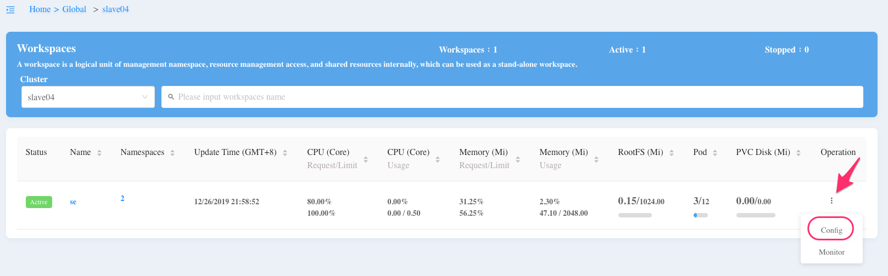
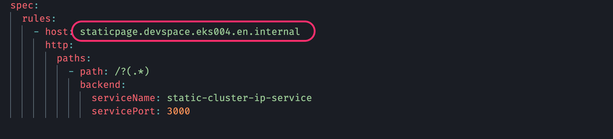
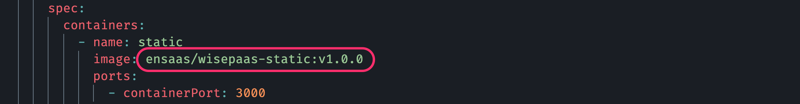
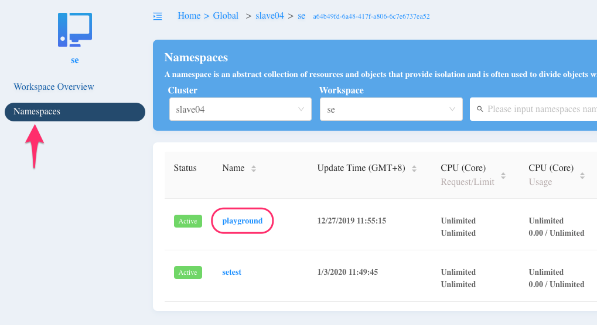

# static-page-k8s

This is a sample code to demonstrate how to deploy a simple static page to the EnSaaS 4.0.


# Deploying to the EnSaaS 4.0

## 1. Getting Your Own Credentials

Go to your [workspace](https://portal-mp-master.es.wise-paas.cn/cluster-info/workspaces) and download the credentials required to manipulate your resources.



You will get prompted to download a config file which contains important credentials. Please make sure you secure this file and **DO NOT LET ANYONE ELSE ACCESS YOUR CONFIG FILE**. You may rename it to whatever you want, say ``wisepass-config``, and then save it to ``$HOME/.kube`` if you are using MacOS.

<br>

## 2. Setting Up KUBECONFIG

If you already have **minikube** installed on your local machine, you will have a file called ``config`` in the directory ``$HOME/.kube``, which is the default file used by Kubernetes. After you start the **minikube**, you can type ``kubectl config view`` to see the information inside this config file.

You may overwrite the ``KUBECONFIG`` environment variable to direct Kubernetes to use the new one that you just downloaded, type ``export KUBECONFIG=$HOME/.kube/wisepaas-config``. Again, you can name it accroding to personal preference. Just make sure that the envrironment variable matches your file name.

<br>

## 3. Clone the Sample Code from WISE-PaaS GitHub

```bash
git clone git@github.com:allguitars/static-page-k8s.git
cd static-page-k8s/
```

<br>

## 4. Building & Pushing Docker Image

- Specify a tag when building the image.

  ```bash
  docker build -t <DockerHubAccount>/<ImageName>:<Tag> .
  ```

  For example: ``wise-paas/static-k8s:v1.0.0``

  <br>

- Push the new image to your own Docker Repository.

  ```bash
  docker push <DockerHubAccount>/<ImageName>:<Tag>
  ```

<br>

## 5. Do a Little Bit Tuning

It requires some minimun effort for you take this code and deploy it to the EnSaaS 4.0.

### I. Setting Up the Host

Modify the ``host`` attribute in ``./k8s-config/ingress-service.yaml``.



<br>

**Format:**

``ApplicationName``.``Workspace``.``Cluster``.**internal**

Note that ``internal`` keyword is required at the end of the string.

<br>

### II. Change the Docker Image Name

Change the ``image`` attribute inside ``./k8s-config/static-deployment.yaml`` file according to the image you just built.

```
<DockerHubAccount>/<ImageName>:<Tag>
```

Here is the example in this code:



<br>

### III. Setting Up the Resource Usage

Modify the ``resources`` attribute inside ``./k8s-config/static-deployment.yaml`` file.


<br>

## 5. Appying the Configuration

**Note**: Always remember to specify the **namespace** that you are working on while applying the Kubernetes configuration.

The following screenshot shows that the namespace is *playgroud*. Yours might be different.



<br>

Apply the Kubernetes configuration.

```bash
kubectl apply -f k8s-config/ --namespace <NameSpace>
```

<br>

Check all resources (also with namespace):

```bash
kubectl get all --namespace playground

NAME                                     READY   STATUS    RESTARTS   AGE
pod/static-deployment-5d996d5d54-97zql   1/1     Running   0          124m

NAME                                TYPE        CLUSTER-IP    EXTERNAL-IP   PORT(S)    AGE
service/static-cluster-ip-service   ClusterIP   10.0.201.35   <none>        3000/TCP   124m

NAME                                READY   UP-TO-DATE   AVAILABLE   AGE
deployment.apps/static-deployment   1/1     1            1           124m

NAME                                           DESIRED   CURRENT   READY   AGE
replicaset.apps/static-deployment-5d996d5d54   1         1         1       124m
```

<br>

## 6. Verifying the Application

In the sample code, we set the host for the Ingress service.

```yaml
host: static.se.slave04.internal
```

So, to see the page, we need to go to the following URL:

http://static-se-slave04.es.wise-paas.cn/

<br>

Mapping rule -- host vs. URL

- host

  ```
  <AppName>.<Workspace>.<Cluster>.internal
  ```

- External URL

  ```
  <AppName>-<Workspace>-<Cluster>.es.wise-paas.cn
  ```

  <br>

The page should look like:


