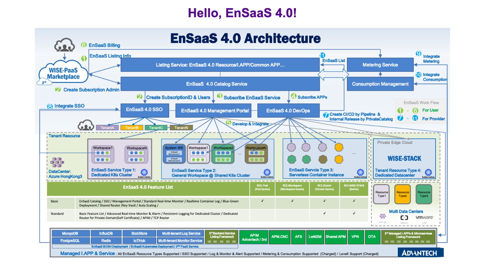

# Testing Your App on the MiniKube

If you want to test your app before deploying it to the production cluster, one way to do this is to use the NodePort service, which provides an entry point to your app without needing to translate the Ingress host to a specific domain.

## Steps

### 1. Switch to the MiniKube

First, make sure the local MiniKube has started properly and you have switched the context to MiniKube.

If you have not installed the MiniKube, see [Install Minikube](https://kubernetes.io/docs/tasks/tools/install-minikube/).

```shell
$ minikube status

host: Running
kubelet: Running
apiserver: Running
kubeconfig: Configured

$ kubectl config get-contexts

CURRENT   NAME                      CLUSTER    AUTHINFO        NAMESPACE
*         minikube                  minikube   minikube
```

### 2. Deploy the app

```shell
$ kubectl apply -f k8s-config\

service/static-page-dave-lee created
deployment.apps/static-page-dave-lee created
ingress.extensions/static-page-dave-lee created
```

Make sure the pod has started successfully.

```shell
$ kubectl get pod

NAME                                   READY   STATUS    RESTARTS   AGE
static-page-dave-lee-6c8996979-tjj7s   1/1     Running   0          85s
```

### 3. Deploy the NodePort service

```shell
$ kubectl apply -f minikube-nodeport\

service/server-node-port created

$ kubectl get svc

NAME                   TYPE        CLUSTER-IP       EXTERNAL-IP   PORT(S)          AGE
kubernetes             ClusterIP   10.96.0.1        <none>        443/TCP          77m
server-node-port       NodePort    10.107.102.118   <none>        3050:31515/TCP   15m
static-page-dave-lee   ClusterIP   10.102.109.162   <none>        3000/TCP         18m
```

_node-port.yaml_

```yaml
apiVersion: v1
kind: Service
metadata:
  name: server-node-port
spec:
  type: NodePort
  ports:
    - port: 3050
      targetPort: 3000
      nodePort: 31515
  selector:
    component: web
    student: dave-lee
```

### 4. Test your app

Retrive the Minikube IP.

```shell
$ minikube ip

172.16.18.0
```

Since we set the nodePort property as ``31515`` in the _node-port.yaml_, we need to add this port to the IP when we want to access the entry page of our app, such as ``http://172.16.18.0:31515/``.

After entering above address into the browser, we can now see the same result locally.


